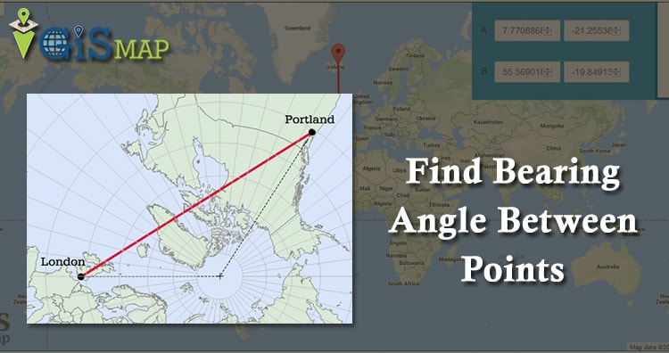
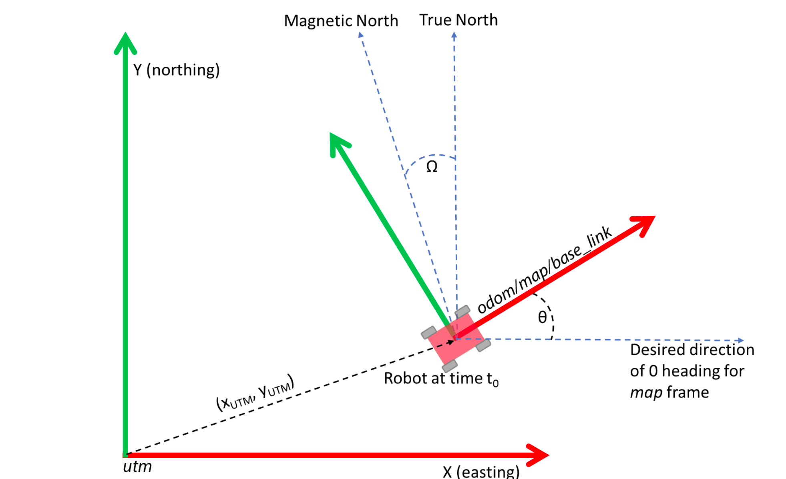
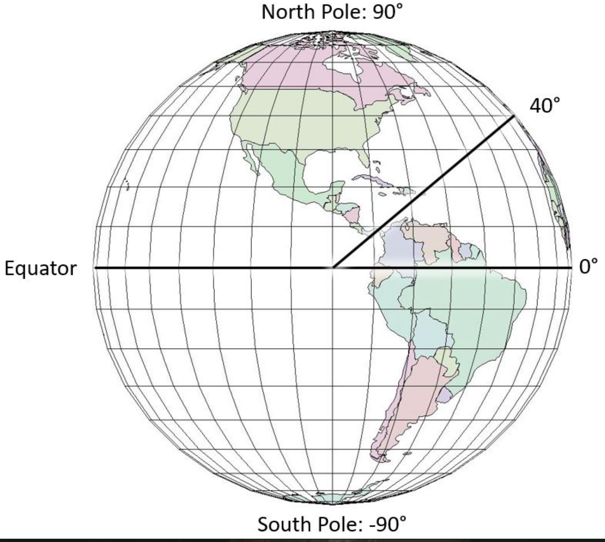
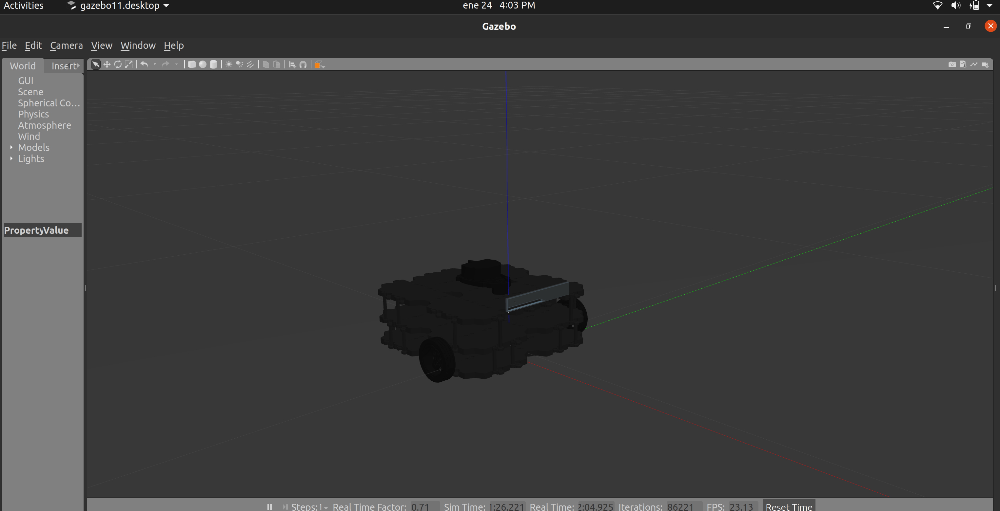

# Turtlebot orientation to Polaris
This is a ROS package to orientate a turtlebot3 to Polaris (North Start) automatically in python. This project was tested in Ubuntu 20.04, Python 3.8.5 and ROS noetic.

## Description
For this task I proposed the use of a GPS plugin in Gazebo [hector gps gazebo plugin](http://wiki.ros.org/hector_gazebo_plugins) to simulate gps data (latitude,longitude). The main idea is to localize the robot using GPS data and then, find the bearing/heading angle between two points (see image below).


 <br/><br/>

Given an initial pose, the turtlebot will generate (latitude,longitude) data which will be use to estime the bearing angle. According to  [GISMAP](https://www.igismap.com/formula-to-find-bearing-or-heading-angle-between-two-points-latitude-longitude/), the process to calculate the bearing angle is the following:

Bearing from point A to B, can be calculated as:

```
β = atan2(X,Y),
```
where, `X` and `Y` are two quantities and can be calculated as:

```
X = cos θb * sin ∆L

Y = cos θa * sin θb – sin θa * cos θb * cos ∆L
```

For this task, 

`L` be the longitude,
`θ` be latitude,
`β` be Bearing.


## Implementation
In this step, I created 3 ROS packages:

1.	**hector_gazebo_plugins**:<br/>
This ROS package contain the gps plugin module that was used to simulate (latitude,longitude) data in gazebo.

2.	**turtlebot3_gazebo**:<br/>
This is the ROS package for the turtlebot3 model. In this package there is an urdf decription file for the robot, where I added the "hector gps" gazebo plugin. 

3.	**turtlebot3_motion_planning**:<br/>
This is the ROS/Python package to estimate the orientation for the robot based in the gps coordinates from the Polaris north start and the gps coordinates from the robot.

## Bearing method calculation
For this process, I assumed polaris north start latitude=90 and longitud=90, according to the image below.

<br/>

The python file: motion_planning.py is based from the ROS tutorial (how to get position and orientation from a robot)(https://www.youtube.com/watch?v=koN9ZqPRG_g). I integrate the GPS subscriber and the method to calculate the bearing angle for the robot.

The code takes:

```
θa = robot_gps_latitude
La = robot_gps_longitude
θb = 90 - robot_gps_latitude
Lb = 90 - robot_gps_longitude
```

## How to build
To build the code you will have to compile the workspace for each ros package from the xihelm folder.<br>

1.	set ros environment:
```
$ source /opt/ros/DISTRO/setup.bash
```

2. compile each ros package in the workspace
```
$ catkin build
```

3. add the workspace directory in the global environment
```
$ source /deve/setup.bash
```

## How to test
For this step, you have to run two launch files: 1. for the robot model in gazebo and 2. another one for the ros/python program to calculate the orientation to polaris north start.

1. launch robot model in gazebo
```
$ roslaunch turtlebot3_gazebo turtlebot3_empty_world.launch
```

2. launch bearing estimation node
```
$ rosrun turtlebot3_motion_planning motion_planning.py
```


## Example
<!-- <br>
<br> -->
<br>

